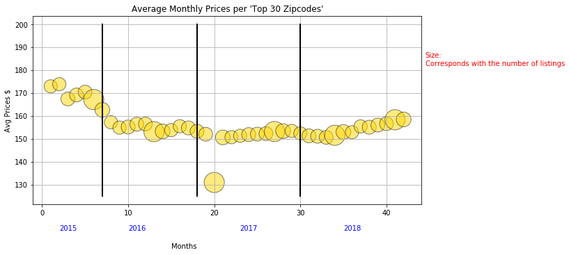

# Price Analysis

------
#### Average Temperature in NYC per month from 2015-2018:
* Jupyter Notebook - [ Code ](https://github.com/mjvillacresesn/AirbnbProject/blob/master/Final_Code/Weather/AvgTemp/AvgWeather.ipynb) 
* Analysis - [Visualizations](https://github.com/mjvillacresesn/AirbnbProject/blob/master/Final_Code/Weather/AvgTemp/README.md)

#### Average Price in NYC per month from 2015-2018 for top listings (based on number of listings per zipcode):
* Jupyter Notebook - [ Code ](https://github.com/mjvillacresesn/AirbnbProject/blob/master/Final_Code/Weather/AvgPrice/AvgPrice.ipynb) 
